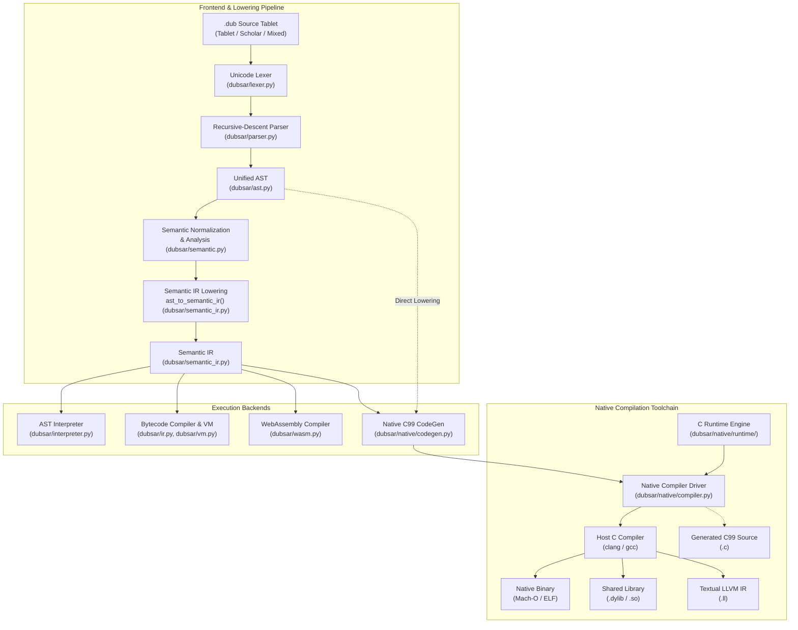

# Compiler Architecture

The DUB.SAR compilation pipeline bridges ancient Mesopotamian mathematical conventions and contemporary systems programming. It translates high-level cuneiform and Latin tablets into canonical intermediate representations and compiles them ahead-of-time (AOT) to native machine code, WebAssembly, or stack bytecode.

---

## 1. Pipeline Overview

The compiler is organized into a modular multi-tier architecture where frontend lexical parsing and semantic normalization are cleanly decoupled from intermediate lowering and backend code generation:



---

## 2. Compilation Phases

The compilation pipeline processes source tablets through six discrete stages:

### Phase 1: Lexical Analysis (`dubsar/lexer.py`)

The lexical tokenizer reads raw UTF-8 source text and emits a stream of strongly typed lexical tokens:

- **Significant Indentation**: Emits `INDENT`, `DEDENT`, and `NEWLINE` tokens to structure recipe problem blocks, loops, and conditional bodies without block delimiters.
- **Multilingual Signs**: Identifies both Latin Scholar Mode keywords (`problem`, `calculate`, `result`, `multiply`) and authentic Unicode cuneiform signs (`𒂊𒁹`, `<ctrl42>`, `𒅗𒁹`, `𒊭`).
- **Sexagesimal Numerals**: Lexes Mesopotamian sexagesimal numbers (`1,24;51,10`), integers, unit labels, and string literals.

### Phase 2: Grammar and AST Construction (`dubsar/parser.py`)

A recursive-descent parser constructs an Abstract Syntax Tree (AST) conforming to the normative DUB.SAR 1.0 EBNF grammar:

- **Unified AST**: Emits homogeneous AST nodes regardless of whether the source tablet was authored in Latin Scholar Mode, cuneiform Tablet Mode, or Mixed Mode.
- **Grammar Formations**: Parses procedure recipes, problem statements, postfix calculation chains, bounded domain searches, determination records, and archival statements.

### Phase 3: Semantic Analysis and Normalization (`dubsar/semantic.py`, `dubsar/normalizer.py`)

The semantic analyzer and normalization rules verify tablet integrity prior to intermediate lowering:

- **Lexical Scoping**: Tracks variable establishments and procedure signatures across nested scopes.
- **Metrological Unit Verification**: Validates dimensional compatibility (e.g. verifying that length and length can be added, but length and mass cannot without explicit conversion).
- **Domain and Bounds Checking**: Enforces non-negative ranges on bounded repetitions and verifies static determination types.
- **Dialect Normalization**: Canonicalizes multi-sign cuneiform tokens and transliterated keywords into a unified internal representation.

### Phase 4: Semantic IR Lowering (`dubsar/semantic_ir.py`)

The AST is lowered into canonical mathematical verbs using `ast_to_semantic_ir()`. Note that `NativeCodeGen.compile()` accepts either a pre-lowered `SemanticProgram` or a raw AST `Program` (invoking `ast_to_semantic_ir()` directly):

- `EstablishVerb`: Introduces named values with optional metrological units.
- `AssignVerb`: Destructures and assigns scalar values or procedure tuples.
- `ApplyMathVerb`: Dispatches arithmetic operations, invocations, and built-in functions.
- `PostfixCalc`: Serializes stack-based calculation pipelines.
- `RepeatVerb`: Captures bounded mathematical iterations (`consider ... from ... through`).
- `DetermineVerb`: Evaluates conditional branching based on mathematical truthiness.
- `RetainVerb`: Implements selection and candidate retention with empty-state initialization.
- `InscribeVerb`: Emits computed values to results or output streams.

### Phase 5: Native C99 Code Generation (`dubsar/native/codegen.py`)

The C99 code generator (`NativeCodeGen`) walks the Semantic IR verbs and generates standard ANSI C99 source code:

- **Identifier Mangling**: Converts alphanumeric and Unicode cuneiform variable names into valid C identifiers using `_mangle_name()` (e.g. mapping cuneiform characters to deterministic `_uXXXX_` escapes).
- **Stack Machine Simulation**: Lowers postfix calculation pipelines into a fixed-depth local stack (`dubsar_val_t _stk[64]`), avoiding dynamic heap allocations for arithmetic sequences.
- **Loop Synthesis**: Emits native C `for` loops with explicit 64-bit integer index bounds for `RepeatVerb`.
- **Procedure Conventions**: Compiles procedures into standard C functions returning `dubsar_tuple_t` structures, supporting multi-value conclusions without heap allocation.

### Phase 6: Host Compilation and Linkage (`dubsar/native/compiler.py`)

The compiler driver orchestrates compilation with the host toolchain:

- Detects available host compilers (`clang`, `gcc`, or `cc`).
- Configures include paths targeting `dubsar/native/runtime/`.
- Compiles the generated C source together with `dubsar_runtime.c` and links the standard C math library (`-lm`).
- Produces the requested target artifact: standalone machine executable (Mach-O on macOS, ELF on Linux), shared dynamic library (`.dylib`/`.so`), textual LLVM IR (`.ll`), or standalone C source code (`.c`).

---

## 3. Subsystem Breakdown

### Code Generator: `dubsar/native/codegen.py`

`NativeCodeGen` manages translation state, temporary variable allocation, and procedure signatures:

- **Temporary Allocation**: Produces isolated scratch identifiers (`_tmp_1`, `_stk_2`, `_tab_3`) for nested operations.
- **Literal Emission**: Translates rational literals into `dubsar_rat_make(nLL, dLL)` calls and text literals into properly escaped C strings.
- **Determination Synthesis**: Generates field tables and dynamic record allocations for structured determinations.
- **Working Tablet Operations**: Translates sequence append, table insertion, linear iteration, and seeking operations into calls against the native tablet API.

### Compiler Driver: `dubsar/native/compiler.py`

`NativeCompiler` encapsulates the build pipeline and provides programmatic compilation interfaces:

- `compile(program, output_path, target="native", opt_level="-O3")`: Compiles an AST or SemanticProgram to the specified target file.
- `generate_c(program)`: Returns generated C99 source code as a Python string.
- `generate_llvm(program)`: Invokes Clang with `-S -emit-llvm -O3` and returns LLVM intermediate representation.
- `run(program, input_preset=None)`: Compiles the tablet to a temporary binary in an isolated scratch directory, executes it, captures stdout and stderr, and returns the exit status.

### Native Runtime: `dubsar/native/runtime/`

The C runtime consists of two primary files:

- `dubsar_runtime.h`: Public API declarations, structure layouts, type enums, and inline tuple helpers.
- `dubsar_runtime.c`: Comprehensive implementation of exact rational arithmetic, geometric models, Fourier transforms, value formatting, and working tablet sequences.

---

## 4. Core Architectural Mechanics

### Exact Rational Representation and 128-Bit Intermediate Accumulation

DUB.SAR models numbers as exact rational values rather than IEEE 754 floating-point representations. In the native and WebAssembly runtimes, the core rational type is bounded to 64-bit signed integer components:

```c
typedef struct {
    int64_t num;
    int64_t den;
} dubsar_rat_t;
```

This representation contrasts with the Python AST Interpreter and Bytecode VM backends, which use Python's unbounded arbitrary-precision integers (`fractions.Fraction`).

#### Hardware 128-Bit Intermediate Accumulation

When compiling with modern 64-bit compilers (`clang` or `gcc`), `__SIZEOF_INT128__` is defined. The runtime uses native 128-bit integers (`__int128_t`) for cross-multiplication:

```c
dubsar_rat_t dubsar_rat_add(dubsar_rat_t a, dubsar_rat_t b) {
#if DUBSAR_HAS_INT128
    dubsar_int128_t num = (dubsar_int128_t)a.num * b.den + (dubsar_int128_t)b.num * a.den;
    dubsar_int128_t den = (dubsar_int128_t)a.den * b.den;
    if (den == 0) return (dubsar_rat_t){0, 1};
    if (num == 0) return (dubsar_rat_t){0, 1};
    dubsar_int128_t g = dubsar_gcd_128(num, den);
    num /= g;
    den /= g;
    if (den < 0) { num = -num; den = -den; }
    return (dubsar_rat_t){(int64_t)num, (int64_t)den};
#else
    /* Fallback using greatest common divisor reduction */
    int64_t g = dubsar_gcd(a.den, b.den);
    int64_t d1 = b.den / g;
    int64_t d2 = a.den / g;
    int64_t num = a.num * d1 + b.num * d2;
    int64_t g2 = dubsar_gcd(num, g);
    num /= g2;
    int64_t den = d2 * (b.den / g2);
    return (dubsar_rat_t){num, den};
#endif
}
```

This 128-bit accumulator design substantially mitigates intermediate arithmetic overflow during intermediate calculations ($a \cdot d \pm b \cdot c$ and $b \cdot d$) before reducing by the greatest common divisor.

**Storage Bounds and Overflow Considerations**: After GCD reduction, the 128-bit numerator and denominator are cast back to bounded 64-bit storage `(int64_t)num` and `(int64_t)den`. The native runtime does not provide unbounded arbitrary-precision arithmetic; if the final reduced rational value exceeds 64-bit signed limits (`[-9223372036854775808, 9223372036854775807]`), numeric overflow will occur. On platforms lacking 128-bit compiler support, the runtime falls back to factorized 64-bit GCD arithmetic.

#### Babylonian Square Root

Square roots are computed using the Babylonian method (Hero's iterative algorithm) directly on exact rational numbers:

$$x_{k+1} = \frac{1}{2} \left( x_k + \frac{S}{x_k} \right)$$

If the radicand is a perfect rational square, `dubsar_rat_is_square()` computes the exact integer square root. Otherwise, four Babylonian iterations yield a high-precision rational approximation.

### Tagged Runtime Value System

Dynamic values in the native runtime use a tagged union representation:

```c
typedef enum {
    DUBSAR_VAL_EMPTY = 0,
    DUBSAR_VAL_RAT,
    DUBSAR_VAL_QUANT,
    DUBSAR_VAL_BOOL,
    DUBSAR_VAL_STR,
    DUBSAR_VAL_TRIANGLE,
    DUBSAR_VAL_INCLINATION,
    DUBSAR_VAL_TURN,
    DUBSAR_VAL_DIRECTION,
    DUBSAR_VAL_DIRECTED,
    DUBSAR_VAL_TABLET,
    DUBSAR_VAL_DETERMINATION
} dubsar_val_kind_t;

struct dubsar_val {
    dubsar_val_kind_t kind;
    union {
        dubsar_rat_t rat;
        dubsar_quant_t quant;
        int boolean;
        const char *str;
        dubsar_triangle_t triangle;
        dubsar_inclination_t inclination;
        dubsar_turn_t turn;
        dubsar_direction_t direction;
        dubsar_directed_t directed;
        dubsar_tablet_t *tablet;
        dubsar_determination_t det;
    } as;
};
```

This model provides uniform storage across scalar numbers, dimensioned quantities, geometric structures, working tablets, and structured determinations.

### Record Determinations

Determinations are structured records with named fields:

```c
typedef struct {
    char name[64];
    dubsar_val_t *val;
} dubsar_field_t;

typedef struct {
    char name[64];
    size_t count;
    dubsar_field_t *fields;
} dubsar_determination_t;
```

Field lookups (e.g. `.area` or `.diagonal`) are resolved via `dubsar_val_get_field()` in $O(N)$ linear scans over small static field counts.

### Bounded Repetitions

Mathematical loops (`consider <target> from <start> through <end>`) are translated into native C `for` loops. Bounds are evaluated once before loop entry and converted to 64-bit integer values using `dubsar_rat_floor()`, ensuring predictable bounds and loop termination.

### Sentinel Retention (`retain`)

The `retain` statement implements candidate selection:

```dubsar
best : empty
consider x from 1 through 10:
    sq : x * x
    retain x when sq <= 50
```

The native code generator translates this into a conditional check that handles the `DUBSAR_VAL_EMPTY` sentinel state:

```c
if (var_best.kind == DUBSAR_VAL_EMPTY || dubsar_val_is_truthy(cond)) {
    var_best = dubsar_val_clone(var_x);
}
```

The target variable is initialized on the first qualifying iteration, matching the high-level scribal semantics.

### Working Tablets and Archival Sequences

Dynamic collections and tables are represented by `dubsar_tablet_t`:

```c
struct dubsar_tablet {
    char name[64];
    dubsar_tablet_shape_t shape;
    size_t count;
    size_t capacity;
    dubsar_entry_t *entries;
    int is_working;
};
```

Supports:
- Sequence appending via `dubsar_tablet_append()` with amortized $O(1)$ capacity doubling.
- Key-value indexing and updates via `dubsar_tablet_put()` and `dubsar_tablet_take()`.
- Nearest-match search via `dubsar_tablet_seek_nearest()`.

### Geometric and Trigonometric Primitives

Mesopotamian geometry is modeled with exact representations for angles, slopes, and triangles:

- **Right Triangles** (`dubsar_triangle_t`): Encapsulates width, length, and diagonal. `dubsar_triangle_determine()` solves for the missing third side given any two sides using the Pythagorean relation, returning exact rational sides when integer squares exist or rational Babylonian approximations otherwise.
- **Inclinations & Feeds** (`dubsar_inclination_t`): Models slopes as exact rational ratios of rise over run and vertical feed rates.
- **Rational Turns** (`dubsar_turn_t`): Expresses angular rotation as exact rational fractions of a full revolution in $[0, 1)$, eliminating irrational degree and radian conversions. Cardinal directions (turns `0`, `1/4`, `1/2`, `3/4`) map symbolically to exact orthogonal coordinates: $(1, 0)$, $(0, 1)$, $(-1, 0)$, and $(0, -1)$.
- **Direction Projections** (`dubsar_direction_t`): For general non-cardinal turns, `dubsar_direction_from_turn()` projects unit components using double-precision floating-point trigonometric functions (`cos`, `sin`) and quantizes the resulting coordinates into exact rational values at micro-unit ($10^{-6}$) precision (`dubsar_rat_make(c_int, 1000000)`).
- **Directed Quantities** (`dubsar_directed_t`): Combines a magnitude, metrological unit, and direction vector, supporting rotations via `dubsar_directed_rotate()`.

### Harmonic Analysis: Discrete and Fast Fourier Transforms

The native runtime includes complete forward and inverse Fourier transform routines:

- `dubsar_tablet_dft()`: Direct $O(N^2)$ Discrete Fourier Transform over working tablet sequences.
- `dubsar_tablet_fft()`: Cooley-Tukey Radix-2 Fast Fourier Transform with $O(N \log N)$ complexity for power-of-two sequence lengths.

Both algorithms return newly allocated working tablets containing transformed components.

---

## 5. Backend Comparison Matrix

| Feature / Dimension | AST Interpreter (`ast`) | Stack Bytecode VM (`vm`) | WebAssembly (`wasm`) | Native Compiler (`native`) |
| :--- | :--- | :--- | :--- | :--- |
| **Status in DUB.SAR 1.0** | **Complete** | **Complete** *(Default)* | **Complete** | **Complete** |
| **Execution Model** | Recursive AST tree-walker | Stack-based bytecode interpreter | Ahead-of-time text/binary WASM | Ahead-of-time machine binary (Mach-O / ELF) |
| **Execution Overhead** | Interpreted AST traversal; highest dispatch and dynamic allocation overhead | Linear instruction loop over operand stack; low dispatch overhead | Direct execution inside host WASM runtime / browser engine | Zero interpreter overhead; direct machine execution optimized by LLVM / GCC |
| **Host Toolchain Required** | Python 3.9+ | Python 3.9+ | None (emits `.wat`) / `wat2wasm` | `clang` or `gcc` |
| **Primary Use Case** | Reference semantics, specification verification | Development, rapid iteration, CLI execution | Web deployment, sandboxed browser execution | High-throughput CLI utilities, batch numerical jobs |
| **Compilation Latency** | None (instant evaluation) | Microseconds (in-memory bytecode compile) | Milliseconds | ~100–300 ms (host C compiler invocation) |
| **Arithmetic Precision** | Exact arbitrary-precision Python rationals | Exact arbitrary-precision Python rationals | Bounded 64-bit integer rational runtime | Bounded 64-bit rationals with 128-bit wider intermediate accumulation |
| **Memory Footprint** | Moderate (Python object overhead) | Low (compact bytecode arrays) | Minimal (linear WebAssembly memory) | Lowest (bare-metal native binary) |
| **SQLite Archive Persistence** | Supported (`--archive`) | Supported (`--archive`) | Not applicable (in-memory execution) | In-memory execution (archive ignored) |
| **Output Presentation** | Configurable (`--format`) | Configurable (`--format`) | Canonical numeric output | Canonical numeric output |
| **External Dependencies** | None (pure Python standard library) | None (pure Python standard library) | None | Standard C99 compiler and C math library (`libm`) |

*Note*: Execution characteristics are qualitative. Actual throughput and memory efficiency depend on tablet complexity, loop count, host hardware, and compiler optimization flags (`-O0` through `-Oz`).

